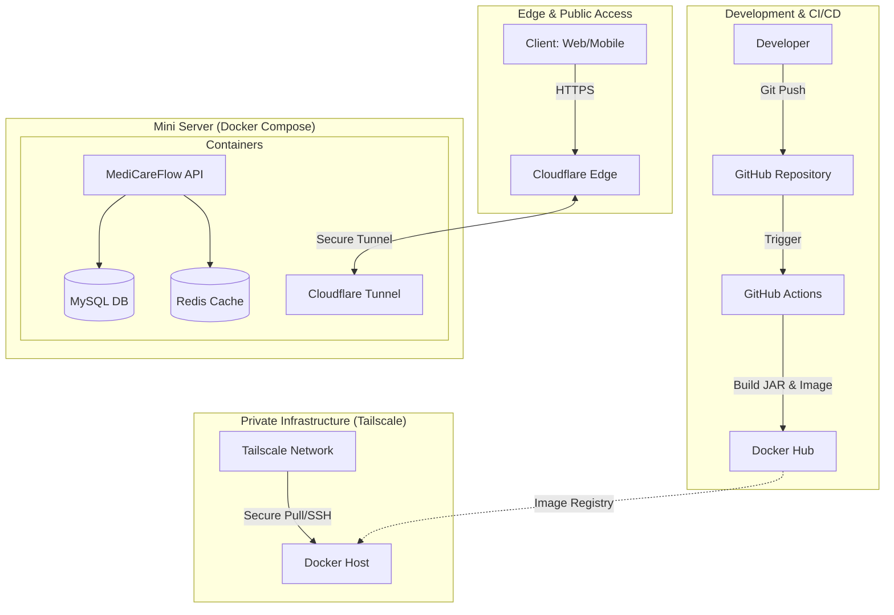

# 🏗️ Detailed System Architecture

This document provides a comprehensive breakdown of the **MediCareFlow** system architecture, covering the development lifecycle, deployment infrastructure, and secure access strategy.

## 🔄 End-to-End System Flow

The following diagram illustrates the complete flow from code commitment to public delivery.

---

## 🚀 1. CI/CD Pipeline

We utilize **GitHub Actions** to automate our delivery pipeline, ensuring that every change is tested and containerized.

- **Source Control:** GitHub acts as the single source of truth.
- **Automated Build:** On every push to the main branch, GitHub Actions builds the bootable JAR file.
- **Containerization:** A Docker image is built from the JAR and pushed to **Docker Hub**.

## 🛡️ 2. Deployment & Infrastructure

The application is hosted on a **Mini Server** using `docker-compose` for orchestration.

- **Network Security:** The server is part of a **Tailscale Private Network**, allowing for secure administrative access (SSH) and image pulling without exposing management ports to the public internet.
- **Data Persistence:** **MySQL** handles relational data with strict constraints.
- **Performance:** **Redis** is used for JWT blacklisting and general caching.

## 🔒 3. Secure Public Access

Instead of traditional port forwarding, we use **Cloudflare Tunnels**.

- **No Inbound Ports:** The server runs a `cloudflared` instance that creates an outbound connection to the Cloudflare Edge.
- **Encrypted Traffic:** All public traffic is forced over HTTPS and protected by Cloudflare’s security suite.
- **Origin Shield:** The physical location and IP of our server remain hidden from the public.
