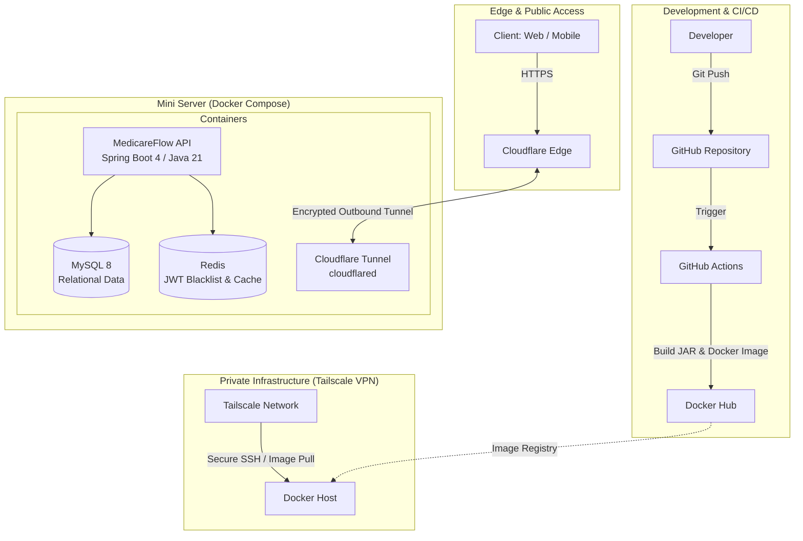

# 🏗️ System Architecture

This document provides a comprehensive overview of the **MedicareFlow** system architecture, covering the development lifecycle, deployment infrastructure, and secure public access strategy.

---

## 🔄 End-to-End System Flow

The diagram below illustrates the complete path from a developer's code commit to a publicly accessible API.


```mermaid
graph TD
    subgraph "Development & CI/CD"
        Dev[Developer] -->|Git Push| Repo[GitHub Repository]
        Repo -->|Trigger| GHA[GitHub Actions]
        GHA -->|Build JAR & Docker Image| DockerHub[Docker Hub]
    end

    subgraph "Private Infrastructure (Tailscale VPN)"
        TS[Tailscale Network] -->|Secure SSH / Image Pull| Server
        DockerHub -.->|Image Registry| Server
    end

    subgraph "Mini Server (Docker Compose)"
        Server[Docker Host]
        subgraph "Containers"
            App[MedicareFlow API\nSpring Boot 4 / Java 21]
            DB[(MySQL 8\nRelational Data)]
            Cache[(Redis\nJWT Blacklist & Cache)]
            Tunnel[Cloudflare Tunnel\ncloudflared]
        end
        App --> DB
        App --> Cache
    end

    subgraph "Edge & Public Access"
        Client[Client: Web / Mobile] -->|HTTPS| CF[Cloudflare Edge]
        CF <-->|Encrypted Outbound Tunnel| Tunnel
    end
```

---

## 🚀 1. CI/CD Pipeline (GitHub Actions)

Every push to the main branch triggers the automated delivery pipeline:

1. **Build:** Maven compiles the project and packages it as a bootable JAR (`Spring Boot 4.0.3`, `Java 21`).
2. **Containerize:** A Docker image is built from the JAR using the project's `Dockerfile`.
3. **Publish:** The image is pushed to **Docker Hub** as `${DOCKERHUB_USERNAME}/medicareflow-api:latest`.

---

## 🛡️ 2. Deployment & Infrastructure

The application runs on a **Mini Server** orchestrated with `docker-compose.yml`:

| Component    | Technology              | Role                                                              |
| ------------ | ----------------------- | ----------------------------------------------------------------- |
| **API**      | Spring Boot 4 (Java 21) | Core application logic                                            |
| **Database** | MySQL 8                 | Persistent relational data storage                                |
| **Cache**    | Redis                   | JWT token blacklisting; general caching                           |
| **Network**  | Tailscale VPN           | Secure admin access (SSH) and private inter-service communication |

> The MySQL and Redis instances are hosted externally on the same Tailscale private network and are accessed via their Tailscale IP addresses defined in the `.env` file.

---

## 🔒 3. Secure Public Access (Cloudflare Tunnel)

Instead of opening inbound firewall ports, the server uses a **Cloudflare Tunnel** (`cloudflared`):

- **No Inbound Ports Exposed:** The `cloudflared` agent on the server maintains an outbound-only connection to Cloudflare's edge.
- **HTTPS Enforced:** All public traffic is automatically forced over HTTPS.
- **Origin Protection:** The server's physical IP address is never exposed to the public internet, shielded behind Cloudflare's network.
- **DDoS Mitigation:** Cloudflare's security suite provides additional protection.

---

## 🔐 4. Application Security Architecture

Within the application itself, security is enforced in layers:

```
Incoming Request
    │
    ▼
[Cloudflare Edge / HTTPS]
    │
    ▼
[JwtFilter]  ← Extracts & validates Bearer token; checks Redis blacklist
    │
    ▼
[Spring Security FilterChain]  ← Role-based route authorization
    │
    ├─ Unauthenticated → CustomAuthenticationHandler (401)
    ├─ Forbidden Role  → CustomAccessDeniedHandler (403)
    │
    ▼
[Controller → Service → Repository]
```

---

## 🛠️ 5. Technology Stack

| Category                | Technology                                  | Version                    |
| ----------------------- | ------------------------------------------- | -------------------------- |
| Language                | Java                                        | 21                         |
| Framework               | Spring Boot                                 | 4.0.3                      |
| Security                | Spring Security + JWT (`jjwt`)              | 0.11.5                     |
| Persistence             | Spring Data JPA + Hibernate                 | (Spring Boot managed)      |
| Database                | MySQL                                       | 8                          |
| Cache / Key-Value Store | Redis (Data Caching & Token Blacklisting)   | (Spring Boot managed)      |
| API Documentation       | SpringDoc OpenAPI (Swagger UI)              | 3.0.1                      |
| Build Tool              | Maven                                       | (via Maven Wrapper `mvnw`) |
| Boilerplate Reduction   | Lombok                                      | (Spring Boot managed)      |
| Bean Validation         | Spring Validation (Jakarta Bean Validation) | (Spring Boot managed)      |
| Containerization        | Docker + Docker Compose                     | -                          |
| CI/CD                   | GitHub Actions                              | -                          |

---

## 📂 6. Project Structure

```text
src/main/java/com/dibimbing/medicareflow/
├── config/         # Spring Security, JWT Filter, Redis, OpenAPI, Scheduler configs
├── controller/     # REST API Controllers (entry points for HTTP requests)
├── dto/            # Data Transfer Objects
│   ├── request/    # Incoming request payloads
│   └── response/   # Outgoing response payloads
├── entity/         # JPA domain models (mapped to database tables)
│   └── base/       # Shared base entities (BaseUuidEntity, BaseLongEntity)
├── enums/          # Enumerations: Role, AppointmentStatus, SlotStatus, DayOfWeek, DoctorStatus
├── exception/      # Custom exceptions, GlobalExceptionHandler, and security handlers
├── helper/         # Utility classes (ResponseHelper, etc.)
├── repository/     # Spring Data JPA interfaces
└── service/        # Business logic and transaction management
```
