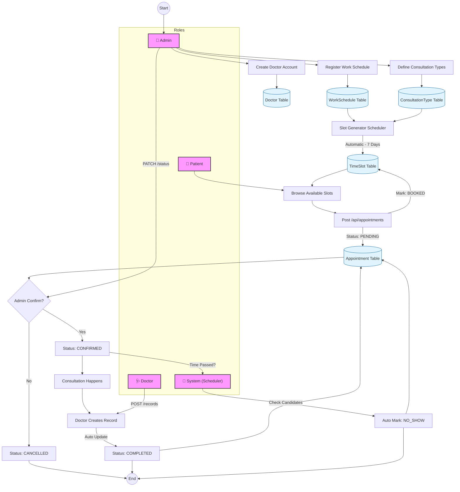

# ✨ Core Features & Application Flow

## Core Features

- **Role-Based Access Control (RBAC):** Three distinct access levels — `ADMIN`, `DOCTOR`, and `PATIENT` — enforced via Spring Security and JWT-based authentication. Public registration is restricted to `PATIENT` only; `ADMIN` or `DOCTOR` registration requires admin privileges.
- **Automated Scheduling Engine:** The system automatically generates available time slots based on a doctor's registered work schedule and the duration defined in each consultation type. Slots are generated for the next 7 days via a scheduled job.
- **High-Performance Caching:** Integrated Spring `@Cacheable` with Redis across all major entities (Appointments, Users, Doctors, Work Schedules), drastically improving read throughput for paginated and single-item fetches.
- **Robust Security & Auth:** JWT authentication with Redis-backed token blacklisting and role-based registration logic.
- **Concurrency Protection:** Unique database constraints prevent double-booking.
- **Appointment State Machine:** Strict status transitions enforced by a state machine (`PENDING` → `CONFIRMED` → `COMPLETED` / `CANCELLED` / `NO_SHOW`). `NO_SHOW` status is automatically handled by a background scheduler.
- **Data Integrity:** UUIDs for account IDs and soft deletion implemented across all core entities.
- **Input Validation:** Comprehensive request generic validation enforcing constraints (size, blanks, nulls, emails) natively handled via Spring Validation with clean user-friendly messages.
- **Unique Reference Numbers:** Automatic generation of unique `referenceNumber` for every appointment.

---

## 🚦 Standard Usage Flow (Appointment Booking)

```
1. Admin Setup
   └─ Admin creates/registers a Doctor account and defines ConsultationTypes.
   └─ New doctors automatically receive default ConsultationTypes based on specialization.

2. Schedule Configuration (Admin)
   └─ Admin registers a WorkSchedule for the doctor (e.g., Mon, 09:00–12:00).

3. Slot Generation (Automated / Manual)
   └─ The Slot Generator creates individual AVAILABLE time slots.

4. Browse & Book (Patient)
   └─ Patient searches available slots and posts POST /api/appointments.
   └─ Status is set to PENDING and slot is marked as BOOKED.

5. Confirmation (Admin)
   └─ Admin updates status to CONFIRMED via PATCH /api/appointments/{id}/status.
   └─ (Note: Manual status updates are restricted to Admin role).

6. Consultation & Record (Doctor)
   └─ After consultation, the doctor creates a record via POST /api/appointments/{id}/records.
   └─ System automatically updates appointment status to COMPLETED.

7. System Automation (Scheduler)
   └─ System periodically scans for CONFIRMED appointments that passed their time.
   └─ These are automatically marked as NO_SHOW.

8. Review (Patient)
   └─ Patient reviews their consultation history and records.
```

---

## 🚦 End-to-End System Flow (Diagram)

The following diagram illustrates the complete lifecycle of a medical consultation, from system configuration to automated status management.



---

## 🔄 Key Process Descriptions

### 1. Automated Slot Generation

The system periodically reads the `WorkSchedule` (e.g., "Doctor John, Mondays 9-12") and the primary `ConsultationType` duration. It then slices the work window into individual `TimeSlot` records.

### 2. The Appointment State Machine

This is a strict lifecycle enforced by the `AppointmentService`:

- **PENDING**: Initial state upon booking.
- **CONFIRMED**: Approved by an administrator.
- **COMPLETED**: Automatically set when a `ConsultationRecord` is created.
- **CANCELLED**: Terminal state if the patient or admin rejects the booking.
- **NO_SHOW**: Terminal state if the appointment time passes without a record.

### 3. Automated Status Checks

To maintain data accuracy, a background **Scheduler** runs every 15 minutes to find `CONFIRMED` appointments whose `endTime` has passed the current server time and marks them as `NO_SHOW`.
