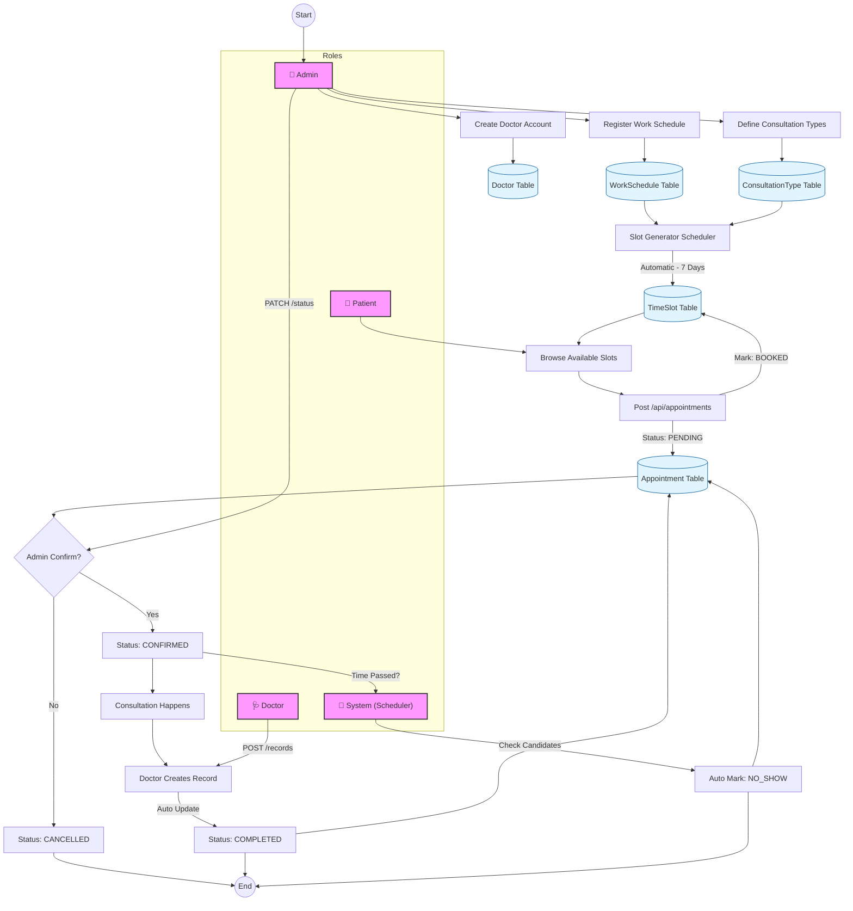

# 📊 MediCareFlow System Flowchart

This document provides a visual representation of the core business logic and data flow within the MediCareFlow system.

---

## 🚦 End-to-End System Flow

The following diagram illustrates the complete lifecycle of a medical consultation, from system configuration to automated status management.

---

## 🔄 Key Process Descriptions

### 1. Automated Slot Generation

The system periodically reads the `WorkSchedule` (e.g., "Doctor John, Mondays 9-12") and the primary `ConsultationType` duration. It then slices the work window into individual `TimeSlot` records.

### 2. The Appointment State Machine

This is a strict lifecycle enforced by the `AppointmentService`:

- **PENDING**: Initial state upon booking.
- **CONFIRMED**: Approved by an administrator.
- **COMPLETED**: Automatically set when a `ConsultationRecord` is created.
- **CANCELLED**: Terminal state if the patient or admin rejects the booking.
- **NO_SHOW**: Terminal state if the appointment time passes without a record.

### 3. Automated Status Checks

To maintain data accuracy, a background **Scheduler** runs every 15 minutes to find `CONFIRMED` appointments whose `endTime` has passed the current server time and marks them as `NO_SHOW`.
